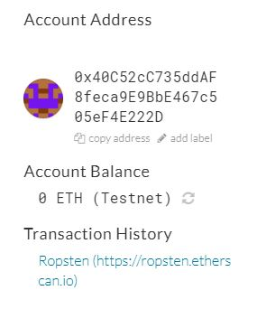
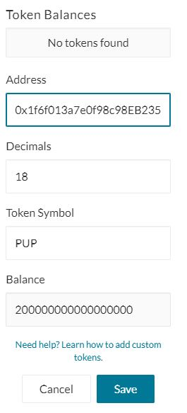
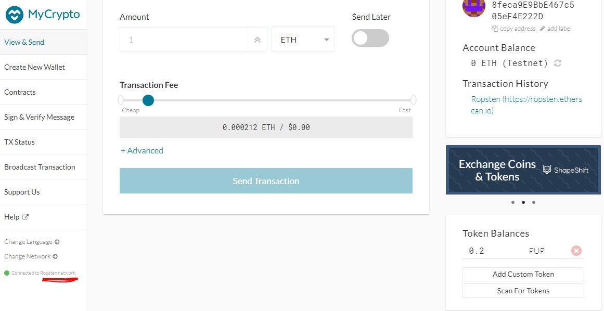

# Advance_Solidity

## PupperCoin Token was setup and was tested using MyCrypto as shown below

### The contract was deployed with following parameters
- We setup the code in such a way to put the rate at spot time and for this example we are using "1" to complete the assignment.

### For the sake of time we changed the code from "now + 24 weeks" to "now + 5 minutes"
- Once the contract is deployed all the features were coming positive as shown below
![Function\(solidity_screenshots/buytoken_functions.JPG)

### To test the transaction we send the Token from one address to another
- Wallet address from where the Token was sent "0x6062105F4F238dF09C1EF9e0C21cbD878c794a1a"
- To which address it was sent "0x40C52cC735ddAF8feca9E9BbE467c505eF4E222D"
- For this entire excercise "Ropsten" Network was used

- All the related screenshots for the testing are below:

- Token sent to screenshot

- Token imported to the address:

- Token Balance after the Token was imported:

- Token Balance showing on Ropsten network:

